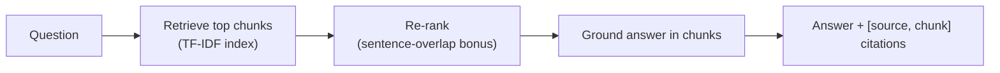

# RAG-over-your-docs kit

[](https://github.com/derekgallardo01/rag-over-docs-kit/actions/workflows/ci.yml) [](LICENSE) [](#)

**Live demo:** [derekgallardo01.github.io/rag-over-docs-kit](https://derekgallardo01.github.io/rag-over-docs-kit/) — sample questions answered with citations across both corpora (workplace + technical docs), regenerated on every push.

A retrieval-augmented-generation kit that answers questions from a set of
documents and **cites the exact source document and chunk** for every answer —
the auditability a business needs before it trusts an AI over its own
knowledge base.

Pure Python standard library, no dependencies, no keys. Ships with TF-IDF
retrieval + a query-aware re-ranker, an interactive REPL, and an evaluation
harness with a golden Q→top-doc set so changes to chunking, re-rank weight, or
the model produce measurable pass/fail outcomes.

```bash
python run.py                # answer 3 sample questions with citations
python cli.py                # interactive REPL ('k N' to change top-k)
python evals/run.py          # CI-gating golden eval set
python -m pytest -q          # 9 unit tests, including re-rank determinism
```

## Run in Docker

```bash
docker build -t rag-kit .
docker run --rm rag-kit                                                  # scripted demo
docker run --rm rag-kit python evals/run.py                              # workplace eval set
docker run --rm rag-kit python evals/run.py golden-tech.json data-tech   # technical-docs eval set
docker run --rm -it rag-kit python cli.py                                # interactive REPL
```

## The problem it solves

"Chatbot over our docs" projects fail when the bot makes things up or can't
show where an answer came from. This kit is built citation-first: it retrieves
the most relevant chunks, re-ranks them with a query-aware bonus, and grounds
the answer in them — returning the source document and chunk index for each so
a human can verify it.



## Architecture in one paragraph

`answer(query, index, k=3)` runs three steps: (1) `index.query` over-retrieves
`2k` TF-IDF candidates; (2) `rerank` re-scores them with
`(1-α)·tfidf + α·sentence_overlap` (default `α=0.35`) so chunks where the query
tokens cluster in a single sentence beat chunks where they're spread across
paragraphs; (3) `complete` generates a cited answer (local stub by default,
Azure / Anthropic adapters wired). Full diagrams + per-component notes:
[docs/architecture.md](docs/architecture.md).

## Sample output

```text
Q: What is the refund policy?
------------------------------------------------------------
# Refund & Returns Policy (sample)  ## Refund policy Customers may request a
refund within 30 days of purchase. ## How to request Submit a refund request
through the support portal with your order number. [1] ...

Sources:
  [1] refunds.md (chunk 0)
  [2] security.md (chunk 0)
```

Captured run including a re-ranking before/after comparison and a
cross-document citation example: [docs/sample-run.txt](docs/sample-run.txt).

## Evaluation

Two corpora ship in the repo to prove the kit isn't a one-trick pony:

- **Workplace corpus** (HR / refunds / security) — 14 cases in [evals/golden.json](evals/golden.json) against [data/](data/).
- **Technical-docs corpus** (auth / rate-limits / webhooks) — 12 cases in [evals/golden-tech.json](evals/golden-tech.json) against [data-tech/](data-tech/).

```bash
$ python evals/run.py
Eval (golden.json): 14/14 passed (100%)

$ python evals/run.py golden-tech.json data-tech
Eval (golden-tech.json): 12/12 passed (100%)
```

How to add cases (real-world failure capture, paraphrases, adversarial queries)
is in [docs/evaluation.md](docs/evaluation.md).

## Customization

Six typical tuning points — corpus, chunk size, top-k, re-rank weight, real
LLM provider, new document types — are walked through in
[docs/customization.md](docs/customization.md). Most are one-line edits in
[ragkit.py](ragkit.py) or env vars.

## What's inside

| Path | Purpose |
|------|---------|
| [ragkit.py](ragkit.py) | The kit: tokenize, chunk, TF-IDF index, **rerank**, complete, answer. |
| [cli.py](cli.py) | Interactive REPL. `k N` adjusts top-k, `quit` exits. |
| [run.py](run.py) | Scripted demo: 3 sample questions through `answer()`. |
| [data/](data/) | Sample documents (HR, refunds, security) to index. |
| [tests/](tests/) | 9 pytest tests covering retrieval, citation, and re-rank behaviour. |
| [evals/](evals/) | Golden Q→top-doc set + CI-gating runner. |
| [docs/](docs/) | Architecture, customization, and evaluation guides. |

## Swapping in a real model

The default answerer is a deterministic local stub so the demo is reproducible
without keys. A real LLM (Azure OpenAI / Anthropic) plugs in behind the existing
`complete()` interface via `LLM_PROVIDER` — the retrieval, re-ranking, chunking,
and citation layers stay exactly the same. Point it at a client's document set
and host it (e.g. an Azure function or a Copilot Studio knowledge source).
Concrete env vars and adapter notes:
[docs/customization.md#4-plug-a-real-llm-azure-openai-or-anthropic](docs/customization.md).
