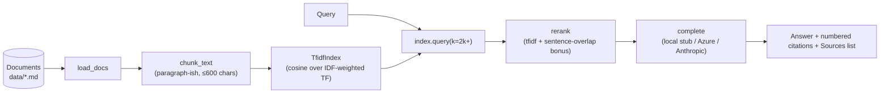
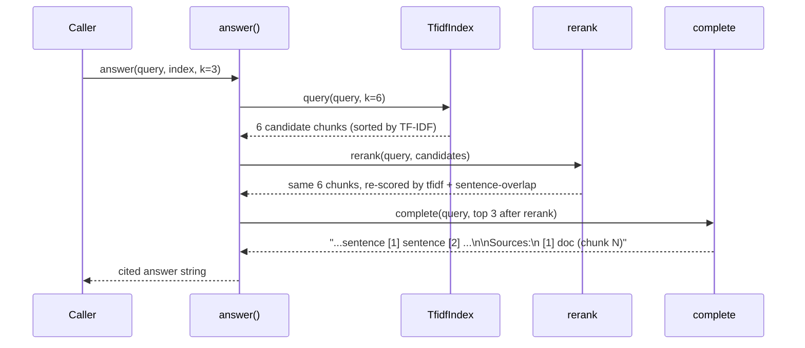

# Architecture

A small, stdlib-only retrieval pipeline that returns answers with the exact
source document and chunk for every citation. The retrieval and ranking layer
stays the same whether you keep the local stub or plug in Azure OpenAI / Claude
for generation.

## Components

| Piece | Lives in | Job |
|-------|----------|-----|
| `load_docs` | [ragkit.py](../ragkit.py) | Reads every `.md`/`.txt` from a folder. |
| `chunk_text` | [ragkit.py](../ragkit.py) | Splits a document into ≤600-char paragraph-ish chunks. |
| `TfidfIndex` | [ragkit.py](../ragkit.py) | IDF-weighted cosine similarity over chunks; `query(k)` returns top-k. |
| `rerank` | [ragkit.py](../ragkit.py) | Re-scores TF-IDF candidates with a query-sentence-overlap bonus. |
| `complete` / `_local_stub` | [ragkit.py](../ragkit.py) | Generates the cited answer. Local stub by default; Azure/Anthropic adapters wired. |
| `answer` | [ragkit.py](../ragkit.py) | The end-to-end function: over-retrieve → rerank → complete. |
| Eval harness | [evals/](../evals/) | Golden Q→top-doc set + runner with CI-gating exit code. |
| CLI REPL | [cli.py](../cli.py) | `ask>` prompt, `k N` to change top-k. |

## Turn sequence

## Why the design looks like this

- **Over-retrieve, then re-rank.** Pure TF-IDF picks the highest-frequency-weighted
  chunks; that's often right but misses cases where a competing chunk has tighter
  *sentence-level* overlap with the query. Retrieving `2k` candidates and re-ranking
  lets a stronger sentence-match win even if its global TF-IDF score is slightly
  lower. See [evaluation.md](evaluation.md) for the cases where this matters.
- **Citations are positional `[n]` + a Sources block.** The position lets the
  generation step inline cites; the Sources block is the auditable trail
  (document + chunk index) a reviewer can verify.
- **Stdlib only.** The whole point is to be runnable in 30 seconds without keys.
  A real model plugs in behind `complete()` via `LLM_PROVIDER` ([customization.md](customization.md)
  walks through the seam).
- **Determinism is enforced.** `rerank` breaks ties by `(doc, idx)` so the same
  query produces the same citation order every time — important for eval gating.

## Where to look first if something goes wrong

| Symptom | Look here |
|---------|-----------|
| Wrong document cited | Add the query to [evals/golden.json](../evals/golden.json) and tune from there. Check tokenization mismatches first (e.g. "password" vs "passwords" — `tokenize` is whitespace+regex, no stemming). |
| Citations dropped from the answer | The `_local_stub` only adds `[n]` for chunks with non-empty best-sentence text. Empty chunks in the corpus produce no citation. |
| Re-rank changes the top in a way that looks wrong | Lower `RERANK_WEIGHT` (default 0.35) — closer to 0 means TF-IDF dominates. Run evals after each change. |
| `answer()` returns the "couldn't find anything" line | Retrieval returned zero hits with score > 0. The query tokens probably don't appear in the corpus (or there's a tokenization mismatch). |
| Adapter for a real model 500s | `_azure_complete` / `_anthropic_complete` are wired but only exercised when `LLM_PROVIDER` is set. Check the env vars and the deployment / model name. |
