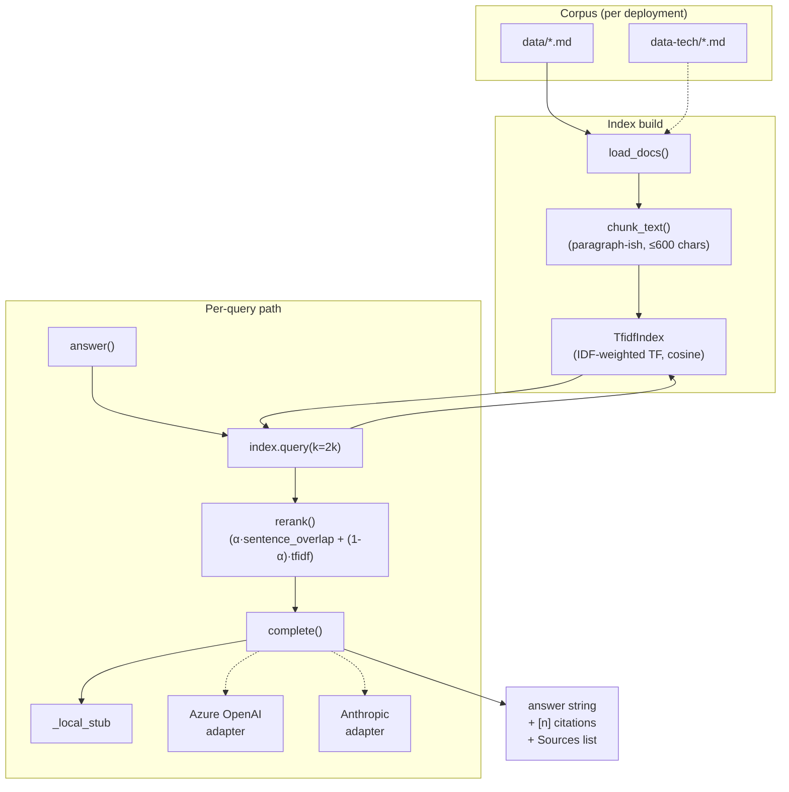
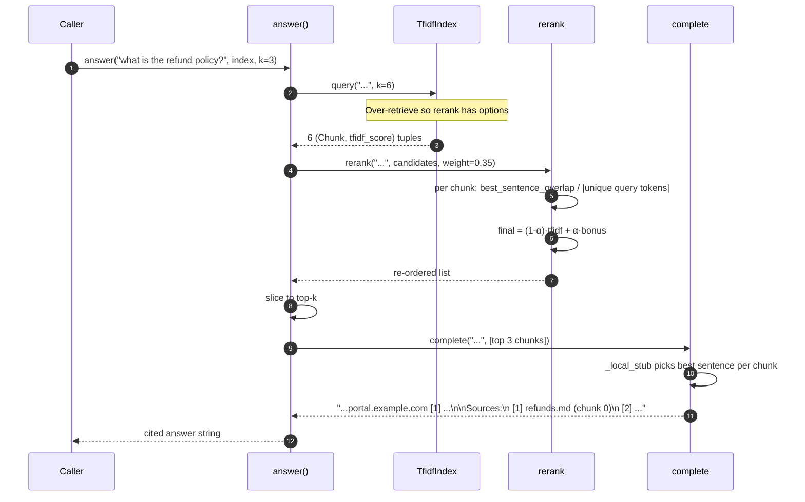
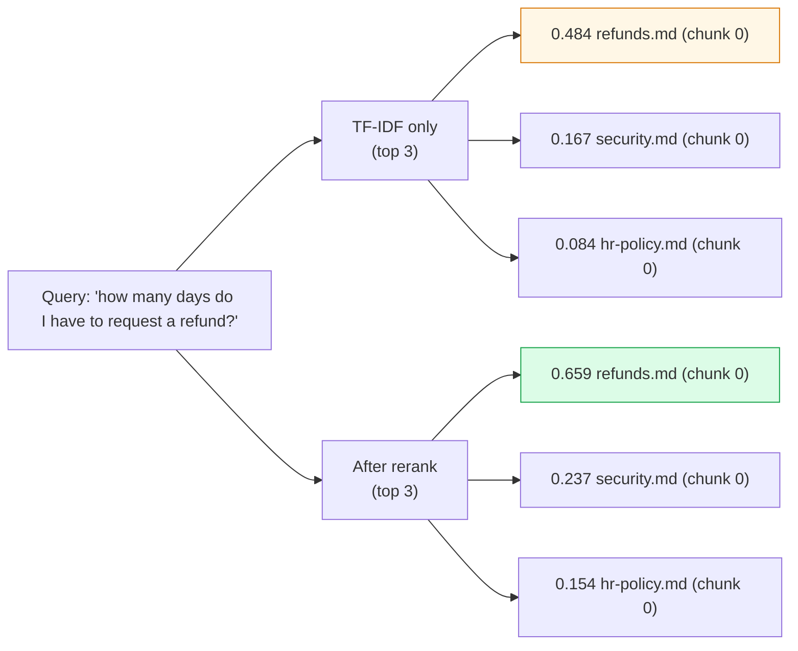
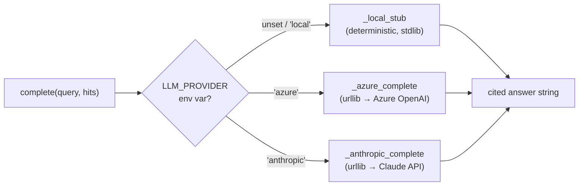

# Diagrams

Architecture / sequence / data diagrams beyond what's already inline in
[architecture.md](architecture.md).

## 1. End-to-end component model

## 2. Sequence — typical answered query

## 3. Re-ranking — why it matters

Same chunks come back; the re-ranker pushes the right-doc score higher
relative to the others when the query tokens cluster in a single sentence
of the chunk. For ambiguous queries this changes the top — see
[evaluation.md](evaluation.md) for the workflow when you catch the kit
getting the order wrong on a real query.

## 4. Provider seam (where the real LLM plugs in)

The retrieval and re-ranking layers don't change when you swap providers
— only the final answer-text generation routes differently. The eval
harness can run against the local stub OR a real model; you'd switch the
env var in CI.
